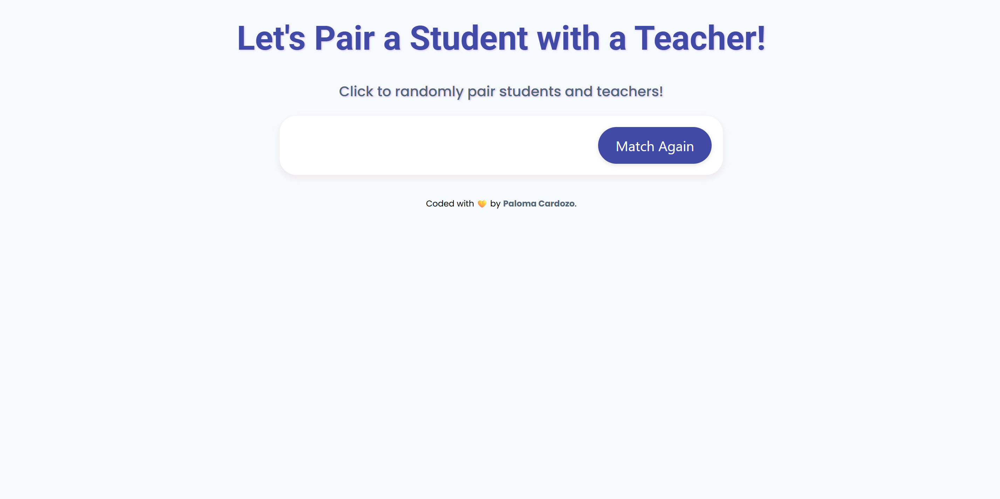

# ReDI School of Digital Integration – Matching App Solution

This is my solution to the ReDI School of Digital Integration challenge called **Smart Match**, a matching interface designed to simulate user interactions in a clean, responsive, and engaging layout. 
This is a static frontend project that displays a swipe-based matching interface. Each card includes a user profile with picture, bio, and interaction buttons. 
The goal was to create an intuitive UI inspired by dating or connection apps, with a strong focus on layout design and user experience. 
The layout was designed using only HTML and CSS. I gave special attention to border radiuses, shadows, and hover effects to simulate interactivity without using JavaScript.

## Table of Contents

- [Overview](#overview)  
  - [Screenshot](#screenshot)  
  - [Links](#links)  
- [My process](#my-process)  
  - [Built with](#built-with)  
  - [What I learned](#what-i-learned)  
  - [Continued development](#continued-development)  
  - [Useful resources](#useful-resources)  
- [Author](#author)  
- [Acknowledgments](#acknowledgments)

## Overview

### Screenshot

Here is a preview of my solution: 

### Links

- **Live Site URL on GitHub**: (https://paloma-cardozo.github.io/SmartMatch/)
- **Repository URL**: (https://github.com/Paloma-Cardozo/SmartMatch)

## My process

### Built with

- Semantic HTML5  
- CSS Flexbox  
- Responsive design techniques  
- Git & GitHub Pages  

### What I learned

This project allowed me to deepen my understanding of **layering elements**, positioning buttons inside a card layout, and playing with spacing, sizing, and visual hierarchy. 
It also gave me a better grasp of how to build mobile-like interfaces using only HTML and CSS.

### Continued development

- Add JavaScript for actual swipe or match interactions  
- Use local storage or mock data to simulate user behavior  
- Explore transitions and animations for smoother visual effects  
- Learn how to implement responsive image loading and optimization  

### Useful resources

- [MDN Web Docs](https://developer.mozilla.org) – For CSS positioning and layout best practices  
- [CSS Tricks](https://css-tricks.com) – Helped me with flex containers and visual balance  
- [GitHub Docs](https://docs.github.com) – For managing project deployment  

## Author

- Frontend Mentor – [@Paloma-Cardozo](https://www.frontendmentor.io/profile/Paloma-Cardozo)
- GitHub URL – [Paloma-Cardozo](https://github.com/Paloma-Cardozo)

## Acknowledgments

I’m beyond grateful for my incredible family—my daughter and my husband—who have made this journey possible with their encouragement and love. 
A big thank you to **ReDI School** for guiding me into this exciting new field and giving me the tools and support to grow. 
